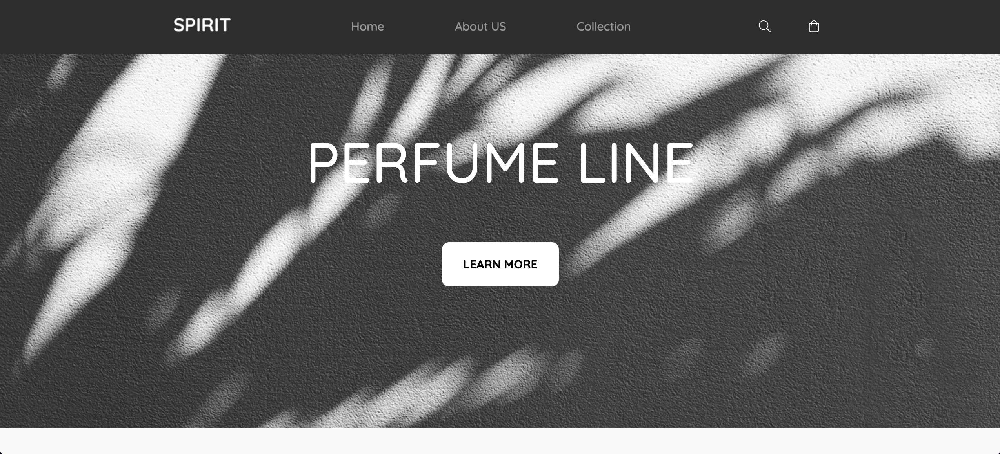
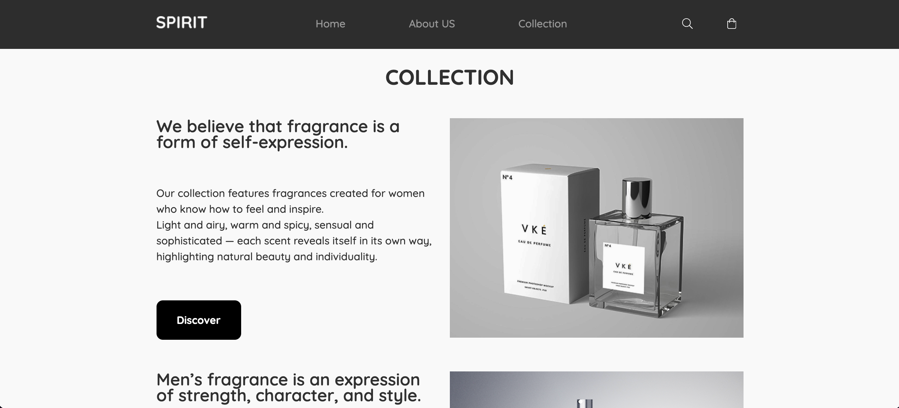
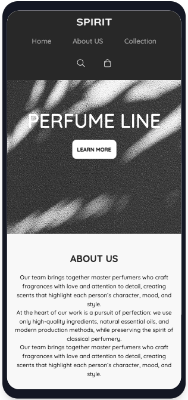
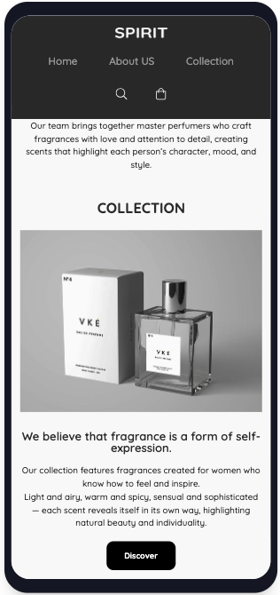

# PERFUME LANDING

Elegant and responsive single-page landing for a perfume brand. The project presents a modern UI with smooth hover effects, clean layout, and adaptive design for different screen sizes.

## Preview

### Desktop




### Mobile




## Features

* Responsive design (Desktop, Tablet, Mobile)
* Fixed navigation bar
* Modern hover animations and UI effects
* Clean and semantic HTML structure
* Custom fonts (Quicksand)
* Optimized layout with Flexbox and media queries

## Technologies

* HTML5
* CSS3 (Flexbox, Media Queries)
* Custom Fonts

## Project Structure

```
perfume-landing/
│
├── css/
│   ├── fonts.css
│   ├── styles.css
│   └── media.css
│
├── fonts/
│   ├── Quicksand-Bold.ttf
│   ├── Quicksand-Medium.ttf
│   └── Quicksand-SemiBold.ttf
│
│── img/
│   ├── icons/
│   │   ├── bag.svg
│   │   └── search.svg
│   ├── logo.png
│   ├── hero-bg.png
│   ├── collection-pic-1.png
│   └── collection-pic-2.png
│
├── screenshots/
│   ├── collection-desktop.png
│   ├── hero-desktop.png
│   ├── mobile-version-collection-part.png
│   └── mobile-version-hero-part.png
│
├── .gitignore
├── index.html
└── README.md
```

## Getting Started

1. Clone the repository:

```
git clone https://github.com/your-username/perfume-landing.git
```

2. Open the project folder.
3. Run `index.html` in your browser.

## Author

**Samandar Sabitov**
GitHub: [https://github.com/samandar-sabitov](https://github.com/samandar-sabitov)

---

*Simple, clean and elegant landing page concept for a perfume brand.*
